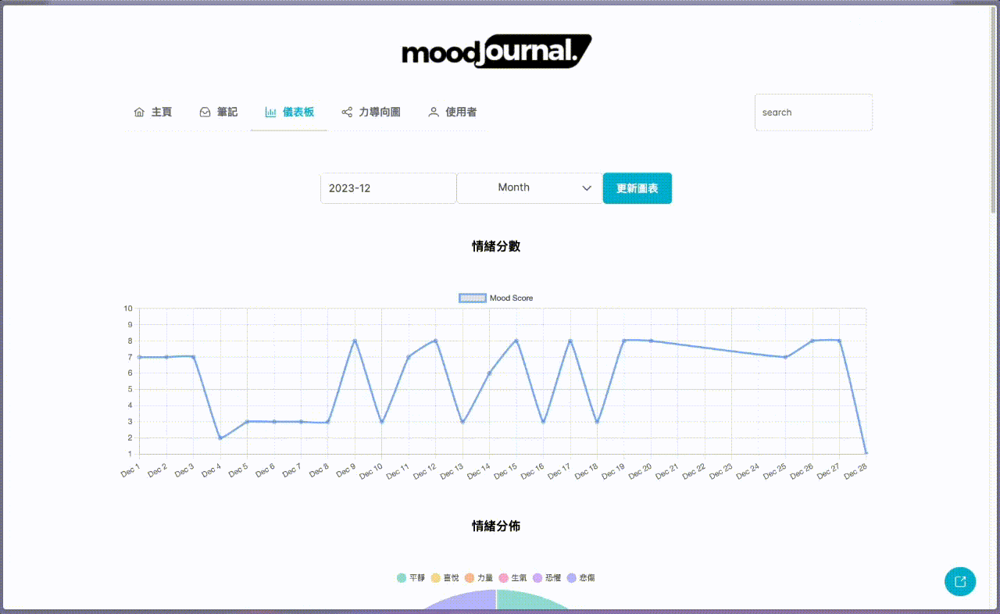

# Mood Journal

## Description

[Mood Journal](https://mood-journal.holly-hsiao.com/) is a mood diary application aimed at helping users understand their emotions better through input, linking, and graphical output of journals.

### Test account

    Email: test@test.com
    Password: test

### Demo Video

## Functions

### Journal Links

Implementing autocomplete using **Elasticsearch** to suggest note titles for users. Developed a customized renderer on **easyMDE** for linking between journals.

### Voice to Text

User-recorded audio is uploaded to **S3** and subjected to voice-to-text processing. The audio and their corresponding textual content are then embedded into HTML within the journals.

### Sentiment Analysis

Integrates **OpenAI API** services to perform sentiment analysis on journal contents. The system returns an emotional score, along with the feelings and influencing factors.

### Mood Calendar

A calendar showing the emotional trends of the month, where warmer and cooler colors represent high and low emotional scores, respectively. Clicking on a date leads to the corresponding diary page.

### Dashboard

The dashboard page developed using **Chart.js**, assists users in observing their emotional records to gain insights. It includes emotional scores, influencing factors, feelings, and key keywords.

### Force Graph

The Force Graph, crafted using **D3.js**, offers users an intuitive understanding of the interrelationships among journals.

## Architecture

## Technologies and Tools

- Back-End

    `JavaScript` `Node.js` `Express` `Elasticsearch` `GraphQL`
- Front-End

    `HTML` `CSS` `Primereact` `Chart.js` `D3.js` `EasyMDE`

- Database

    `MongoDB` `Redis`

- AWS Services

    `EC2` `S3` `ElastiCache` `CloudWatch` `CloudFront`

- Others

    `Vitest` `K6` `GitHub Actions`

## Reference

[API Doc](https://studio.apollographql.com/sandbox/explorer?endpoint=https://mood-journal.holly-hsiao.com/graphql)

## Author

Holly Hsiao: <yahanhsiao@gmail.com>
